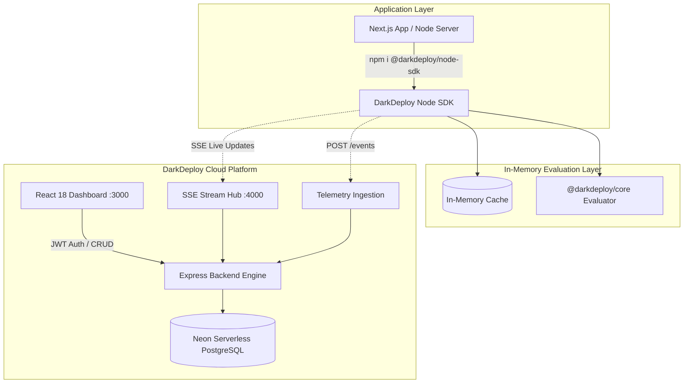

# DarkDeploy

> **The Modern, High-Performance Feature Flagging, Live A/B Experimentation, and Dynamic AI Configuration Platform.**

[](https://www.npmjs.com/package/@darkdeploy/core)
[](https://www.npmjs.com/package/@darkdeploy/node-sdk)
[](https://opensource.org/licenses/MIT)
[](#)
[](#)

DarkDeploy is an open-source, developer-first alternative to LaunchDarkly, Optimizely, and Statsig.

It combines a **high-performance deterministic evaluation engine**, **real-time Server-Sent Events (SSE) streaming**, **A/B experimentation with frequentist statistical analysis**, and **dynamic AI configuration management** to hot-swap LLM models and prompts without code redeployments.

---

## Live Cloud Endpoints

* **Live Production API:** https://darkdeploy-api.onrender.com
* **API Health Check:** https://darkdeploy-api.onrender.com/health
* **SSE Live Stream:** https://darkdeploy-api.onrender.com/api/stream
* **npm SDK:** https://www.npmjs.com/package/@darkdeploy/node-sdk
* **npm Core:** https://www.npmjs.com/package/@darkdeploy/core

---

## System Architecture



---

## Core Capabilities

### 1. Zero-Latency Feature Flags & Percentage Rollouts

* **Local In-Memory Evaluation**
  Evaluates feature flags locally without making blocking network requests for every user interaction.

* **Deterministic SHA-1 Bucketing**
  Ensures that a user consistently receives the same rollout bucket across servers and restarts.

* **Complex Targeting Rules**
  Target users based on attributes such as:

  * `plan`
  * `role`
  * `country`
  * `version`

  Supported operators:

  ```text
  EQUALS
  NOT_EQUALS
  IN
  NOT_IN
  CONTAINS
  STARTS_WITH
  ENDS_WITH
  GREATER_THAN
  LESS_THAN
  ```

---

### 2. A/B Testing & Statistical Engine

DarkDeploy supports deterministic multi-variant experiments with automatic exposure and conversion tracking.

#### Multi-Variant Allocation

Traffic can be distributed across control and custom variants:

```text
50 / 50
33 / 33 / 34
70 / 30
25 / 25 / 25 / 25
```

#### Automatic Telemetry

Exposure events and conversion metrics can be tracked directly through the SDK:

```typescript
await client.track(
  "checkout-color-exp",
  { id: "usr_42" },
  "CONVERSION",
  99.00
);
```

#### Statistical Significance

DarkDeploy provides two-proportion z-test analysis, p-value approximation, relative lift, and confidence intervals.

The pooled conversion rate is:

$$
\hat{p} = \frac{c_A + c_B}{n_A + n_B}
$$

The z-score is:

$$
Z =
\frac{\hat{p}_B - \hat{p}_A}
{\sqrt{
\hat{p}(1-\hat{p})
\left(
\frac{1}{n_A}+\frac{1}{n_B}
\right)
}}
$$

---

### 3. AI Configs & Dynamic LLM Prompts

DarkDeploy allows AI applications to dynamically change model configuration without redeploying the application.

#### Foundation Model Switching

Switch between models such as:

```text
gpt-4o
claude-3-5-sonnet
gemini-1.5-pro
```

#### Runtime Configuration

Control:

* Model
* Temperature
* Maximum tokens
* System prompts
* Experiment variants

Example:

```typescript
const aiConfig = client.getAIConfig(
  "support-agent-prompt",
  { id: "usr_42" },
  {
    model: "gpt-4o",
    temperature: 0.7,
    systemPrompt: "You are a standard helpful assistant.",
  }
);

console.log("Active Model:", aiConfig.model);
console.log("System Prompt:", aiConfig.systemPrompt);
```

Changes can be propagated to SDK clients through the real-time SSE connection.

---

### 4. Real-Time Push Delivery via SSE

DarkDeploy uses **Server-Sent Events (SSE)** to keep SDK clients synchronized with configuration changes.

When a flag or experiment changes:

```text
Dashboard
    ↓
Backend
    ↓
SSE Stream
    ↓
Connected SDK Clients
    ↓
Local Cache Updated
```

Example events:

```text
flag_updated
experiment_updated
ai_config_updated
```

This eliminates the need for constant polling.

---

### 5. Environment Isolation & Audit Logging

DarkDeploy supports separate environments for configuration management:

```text
Development
Staging
Production
```

Configuration changes can be recorded with:

* Before/after configuration state
* User responsible for the change
* Timestamp
* Environment
* Resource modified

The dashboard also provides convenient API key management.

---

# Monorepo Structure

```text
Darkdeploy/
├── packages/
│   ├── core/
│   │   └── @darkdeploy/core
│   │       ├── Deterministic hashing
│   │       ├── Targeting rules
│   │       └── Statistical engine
│   │
│   ├── server/
│   │   └── @darkdeploy/server
│   │       ├── Express API
│   │       ├── Prisma
│   │       ├── PostgreSQL
│   │       ├── SSE stream hub
│   │       └── Telemetry ingestion
│   │
│   ├── sdk-node/
│   │   └── @darkdeploy/node-sdk
│   │       ├── Local cache
│   │       ├── Feature evaluation
│   │       └── SSE synchronization
│   │
│   └── dashboard/
│       └── React 18 admin dashboard
│
├── examples/
│   ├── store-demo.ts
│   └── demo-app.ts
│
├── package.json
└── tsconfig.base.json
```

---

# Quickstart

## Prerequisites

* Node.js 18+
* PostgreSQL
* npm

You can use [Neon](https://neon.tech) for a serverless PostgreSQL database.

---

## 1. Clone & Install

```bash
git clone https://github.com/S-Rohan-Kumar/Darkdeploy.git

cd Darkdeploy

npm install
```

---

## 2. Configure Environment Variables

Create:

```text
packages/server/.env
```

Add:

```env
PORT=4000
DATABASE_URL="your_postgresql_connection_string"
JWT_SECRET="super-secure-random-jwt-secret-key"
```

---

## 3. Initialize & Seed Database

Build the project:

```bash
npm run build
```

Initialize Prisma:

```bash
npx prisma db push --schema=packages/server/prisma/schema.prisma
```

Seed the database:

```bash
npm run db:seed --workspace=@darkdeploy/server
```

The seed process creates an initial development environment and administrator account.

> **Security:** Never commit real production passwords, API keys, JWT secrets, or database credentials to the repository.

---

## 4. Start Development Servers

Start the backend:

```bash
npm run dev:server
```

Start the dashboard:

```bash
npm run dev:dashboard
```

Local services:

| Service     | URL                              |
| ----------- | -------------------------------- |
| Dashboard   | http://localhost:3000            |
| Backend API | http://localhost:4000            |
| SSE Stream  | http://localhost:4000/api/stream |

---

## 5. Run the Real-Time Showcase

```bash
npm run demo:store
```

This demonstrates DarkDeploy's real-time feature flag and configuration synchronization.

---

# Production Deployment

DarkDeploy can be deployed using low-cost or free-tier infrastructure.

| Service       | Platform                     | Purpose                |
| ------------- | ---------------------------- | ---------------------- |
| Database      | [Neon](https://neon.tech)    | Serverless PostgreSQL  |
| Backend & SSE | [Render](https://render.com) | Express API + SSE      |
| Dashboard     | [Vercel](https://vercel.com) | React frontend         |
| SDK           | [npm](https://www.npmjs.com) | Public Node.js package |

### Backend Build

```bash
npm ci --include=dev
npm run build --workspace=@darkdeploy/core
npm run build --workspace=@darkdeploy/server
```

### Backend Start

```bash
node packages/server/dist/index.js
```

### Dashboard

```text
Root: packages/dashboard
Build: npm run build
Output: dist
```
---

# SDK Usage

## Installation

```bash
npm install @darkdeploy/node-sdk
```

---

## Feature Flags

```typescript
import { DarkDeployClient } from "@darkdeploy/node-sdk";

const client = new DarkDeployClient({
  apiKey: process.env.DARKDEPLOY_API_KEY!,
  baseUrl: "https://darkdeploy-api.onrender.com",
});

await client.initialize();

const isEligible = client.isEnabled("vip-pricing", {
  id: "usr_42",
  attributes: {
    plan: "enterprise",
    country: "US",
  },
});

console.log("VIP pricing enabled:", isEligible);
```

---

## A/B Testing & Tracking

```typescript
const variant = client.getVariant(
  "checkout-color-exp",
  { id: "usr_42" }
);

console.log("Assigned variant:", variant?.key);

await client.track(
  "checkout-color-exp",
  { id: "usr_42" },
  "CONVERSION",
  99.00
);
```

---

## Dynamic AI Configuration

```typescript
const aiConfig = client.getAIConfig(
  "support-agent-prompt",
  { id: "usr_42" },
  {
    model: "gpt-4o",
    temperature: 0.7,
    systemPrompt: "You are a standard helpful assistant.",
  }
);

console.log("Active Model:", aiConfig.model);
console.log("Temperature:", aiConfig.temperature);
console.log("System Prompt:", aiConfig.systemPrompt);
```

---

# Why DarkDeploy?

| Capability                | DarkDeploy |
| ------------------------- | ---------- |
| Local feature evaluation  | ✅          |
| Deterministic rollouts    | ✅          |
| Percentage rollouts       | ✅          |
| Complex targeting         | ✅          |
| A/B experimentation       | ✅          |
| Statistical significance  | ✅          |
| Real-time SSE updates     | ✅          |
| Dynamic AI configuration  | ✅          |
| Runtime prompt management | ✅          |
| Environment isolation     | ✅          |
| Audit logging             | ✅          |
| Node.js SDK               | ✅          |
| Open source               | ✅          |

---

# Technology Stack

### Backend

* Node.js
* TypeScript
* Express
* Prisma
* PostgreSQL

### Frontend

* React 18
* TypeScript
* Modern dashboard UI

### SDK

* TypeScript
* Local in-memory evaluation
* SSE synchronization

### Infrastructure

* Neon
* Render
* Vercel
* npm

---

# Roadmap

* [ ] Python SDK
* [ ] Java SDK
* [ ] Browser SDK
* [ ] Advanced experiment analytics
* [ ] Bayesian experimentation
* [ ] Webhook integrations
* [ ] Slack notifications
* [ ] Role-based access control
* [ ] Team management
* [ ] Feature flag dependency graphs
* [ ] OpenTelemetry integration
* [ ] AI configuration versioning

---

# Contributing

Contributions are welcome.

1. Fork the repository.
2. Create a feature branch.

```bash
git checkout -b feature/my-feature
```

3. Make your changes.
4. Run the test suite.

```bash
npm test
```

5. Commit your changes.

```bash
git commit -m "feat: add my feature"
```

6. Push your branch.

```bash
git push origin feature/my-feature
```

7. Open a pull request.

---

# License

MIT License.

DarkDeploy is designed as an open-source, developer-first platform for feature management, experimentation, and dynamic AI configuration.
